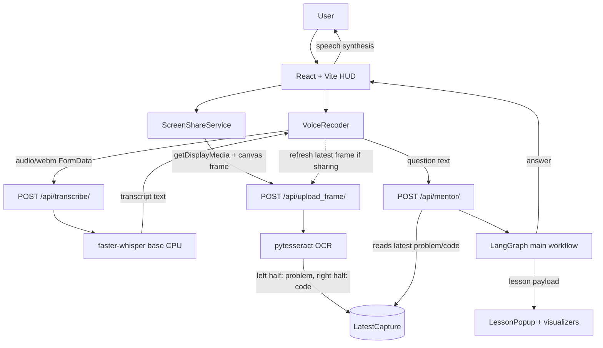
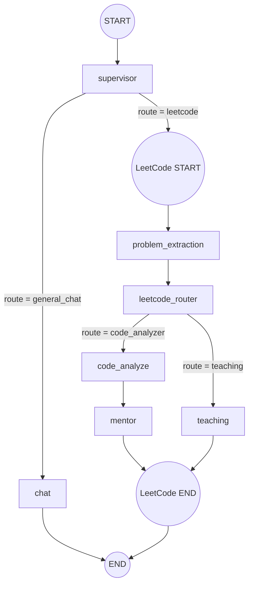

# Jarvis LeetCode

Jarvis LeetCode is a voice-first LeetCode mentor. The frontend captures the user's screen and voice, the Django backend extracts the current problem/code from the screen, transcribes the spoken question, and routes the request through a LangGraph agent workflow that can either answer directly or generate an interactive lesson.

## Current Architecture



## LangGraph Agent Graph

The backend graph is defined in `backend/mentor/graph/main_graph.py` and `backend/mentor/graph/leetcode_graph.py`. The main graph first asks the supervisor whether the question is LeetCode-specific or general chat. LeetCode requests enter a nested graph that extracts the problem name, decides whether to analyze submitted code or teach a concept, and then returns either an answer or lesson steps.



### Graph Nodes

- `supervisor`: classifies the user question as `leetcode` or `general_chat`.
- `chat`: answers non-LeetCode/general questions.
- `problem_extraction`: extracts the problem name from OCR text.
- `leetcode_router`: routes the LeetCode request to `code_analyzer` or `teaching`.
- `code_analyze`: analyzes the latest captured code against the extracted problem.
- `mentor`: turns the analysis, code, problem name, and question into a conversational answer, then stores it in `Conversation`.
- `teaching`: returns structured lesson data for the lesson player and visualizers.

## Backend

The backend is a Django 6 + Django REST Framework app in `backend/`.

Key paths:

- `mentor/api/views.py`: REST endpoints for OCR capture, transcription, and mentor orchestration.
- `mentor/graph/main_graph.py`: top-level LangGraph workflow.
- `mentor/graph/leetcode_graph.py`: nested LeetCode workflow.
- `mentor/graph/node.py`: node functions that call the individual agents.
- `mentor/graph/state.py`: shared `CodeWispherState` graph state.
- `mentor/agents/*`: supervisor, chat, problem extraction, LeetCode router, code analyzer, mentor, and teaching agents.
- `mentor/llms/factory.py`: selects Groq or Ollama-backed LLMs per agent.
- `mentor/services/ocr_service.py`: decodes a base64 image, splits it into problem/code halves, and runs Tesseract OCR.
- `mentor/services/whisper_service.py`: transcribes uploaded audio with `faster-whisper`.
- `mentor/models.py`: stores `LatestCapture` and answered `Conversation` records.

### API Endpoints

- `POST /api/upload_frame/`
  - Body: `{ "image": "data:image/png;base64,..." }`
  - Runs OCR on the screenshot, stores the latest problem/code capture, and returns `{ "problem": "...", "code": "..." }`.
- `POST /api/transcribe/`
  - Multipart field: `audio`
  - Writes a temporary `.webm` file, runs Whisper transcription, and returns `{ "text": "..." }`.
- `POST /api/mentor/`
  - Body: `{ "question": "..." }`
  - Reads the latest OCR capture, invokes the LangGraph workflow, and returns either:
    - `{ "type": "answer", "data": "..." }`
    - `{ "type": "lessons", "data": { ... } }`

## Frontend

The frontend is a React + Vite app in `frontend/`.

Key paths:

- `src/App.jsx`: Jarvis-style HUD, orb controls, screen share button, mentor answer panel, and lesson popup.
- `src/components/voiceRecoder.jsx`: records microphone audio, calls transcription, refreshes the current screen frame, calls `/api/mentor/`, and speaks answers with browser speech synthesis.
- `src/components/screenshare/ScreenShareButton.jsx`: starts browser screen sharing.
- `src/services/screenShareService.js`: owns the display media stream and captures a PNG frame through a canvas.
- `src/services/api.js`: helper for `/api/upload_frame/`.
- `src/lesson/*`: lesson player, speech service, and data-structure visualizers.

## End-to-End Flow

1. The user starts screen sharing from the frontend.
2. The user records a spoken question.
3. The frontend sends audio to `/api/transcribe/`.
4. The frontend captures the latest shared-screen frame and sends it to `/api/upload_frame/`.
5. OCR stores the latest problem statement and code in `LatestCapture`.
6. The frontend sends the transcript to `/api/mentor/`.
7. The backend invokes the LangGraph workflow with `question`, `ocr_text`, and `code`.
8. The workflow returns either a normal mentor answer or a structured teaching lesson.
9. The frontend displays the answer or opens the lesson popup; answers are also spoken through browser speech synthesis.

## Running Locally

Backend:

```powershell
cd backend
python -m venv .venv
.\.venv\Scripts\activate
pip install -r requirements.txt
python manage.py migrate
python manage.py runserver
```

Frontend:

```powershell
cd frontend
npm install
npm run dev
```

The frontend expects the backend at `http://localhost:8000/api`.

## Notes

- `faster-whisper` currently uses the `base` model on CPU with `int8` compute.
- OCR assumes the problem text is on the left half of the screenshot and code is on the right half.
- The mentor endpoint requires a previous or freshly captured OCR frame; otherwise it returns `No OCR capture found. Capture a frame first.`
- LLM routing is centralized in `LLMFactory`: problem extraction uses Ollama, while mentor, code analysis, supervisor, and LeetCode routing use Groq-backed chat models.
